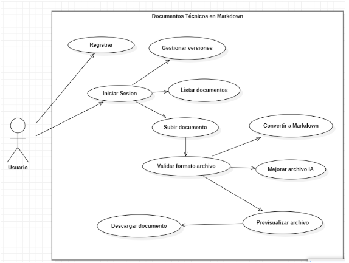
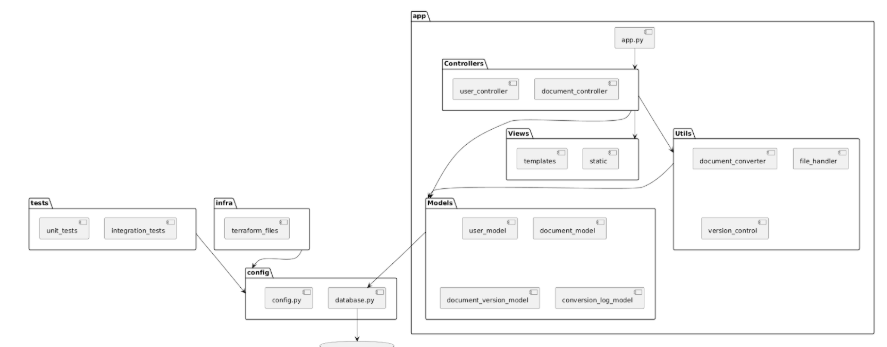
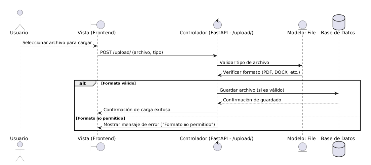
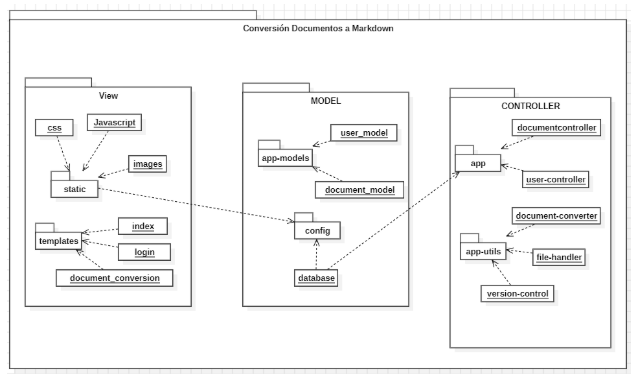
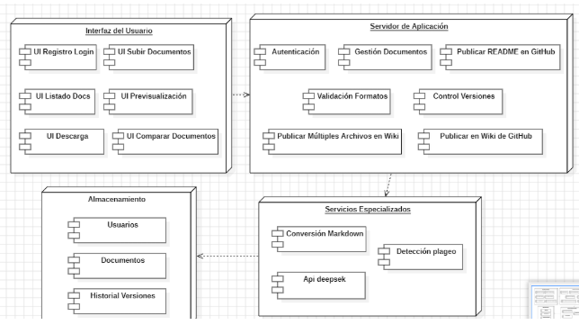
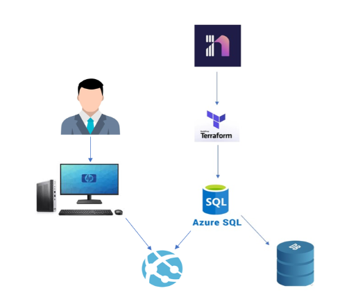
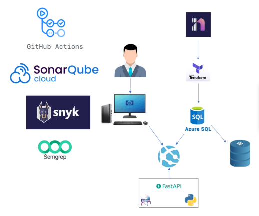

CURSO: PATRONES DE SOFTWARE

Integrantes:

Chambi Cori Jerson Roni (2021072619)

Flores Quispe Jaime Elias (2021070309)

Leyva Sardón Elvis Ronald (2021072614)

Brian Danilo Chite Quispe (2021070015)

# 🚀 Proyecto: Desarrollo de un Sistema de Conversión y Organización de Documentos Técnicos en Markdown con Estructuración Automática y Control de Versiones para los estudiantes en la facultad de Ingeniería de Sistemas

Este proyecto permite la conversión automática de documentos en diversos formatos (Word, PDF, HTML, TXT) al formato **Markdown** y la organización de estos documentos en un sistema estructurado con control de versiones. El proyecto está diseñado para estudiantes y docentes de la Facultad de Ingeniería de Sistemas de la Universidad Privada de Tacna.

## Tecnologías y Herramientas Principales

- **Cosine Similarity**: Integrado para la detección de plagio entre documentos, permitiendo comparar la similitud entre textos de manera eficiente.
- **Deepseek Azure AI Foundry**: Se emplea inteligencia artificial para mejorar el procesamiento y análisis de los documentos, aportando capacidades avanzadas de clasificación y organización automática.
- **FastAPI**: Framework utilizado para la creación de APIs rápidas, eficientes y fáciles de mantener, facilitando la interacción con el sistema y la integración con otros servicios.
- **Control de Versiones**: Gestión y seguimiento de los cambios realizados a los documentos, asegurando integridad y trazabilidad.
- **Terraform**: Para la gestión y despliegue de infraestructura, especialmente útil para entornos en la nube.
- **SQL Server / Azure SQL**: Base de datos centralizada para almacenamiento y consulta eficiente de los documentos y metadatos.

## Diagrama caso de uso 



## Paquetes de secuencia 

##  1. Validar formato de archivo



## Diagrama de arquitectura software

## Diagrama de arquitectura del sistema (Diagrama de componentes)

## Vista de Despliegue
Diagrama de infraestructura

Diagrama de arquitectura



## Requisitos del Sistema

Antes de instalar y ejecutar el proyecto, asegúrate de tener los siguientes requisitos:

- **Sistema Operativo**: Compatible con Linux, macOS y Windows
- **Python**: Versión 3.8 o superior
- **Dependencias**: Todas las dependencias necesarias se encuentran en el archivo `requirements.txt`
- **Base de Datos**: **SQL Server** (Azure SQL para bases de datos en la nube)
- **Terraform**: Para la gestión de infraestructura (si es necesario)

## Instalación

### 1. Clona el repositorio
```bash
git clone https://github.com/UPT-FAING-EPIS/proyecto-si889-2025-i-u1-floresq_chambi_leyva.git
```
2️⃣ Configura el entorno virtual
Para evitar conflictos con otras bibliotecas, es recomendable crear un entorno virtual.
     
```bash
python -m venv venv
```
En Windows:

```bash
Set-ExecutionPolicy -ExecutionPolicy RemoteSigned -Scope Process
.\venv\Scripts\Activate.ps1
```

3️⃣ Instala las dependencias
Con el entorno virtual activado, instala las dependencias necesarias:

```bash
pip install -r requirements.txt
```

4️⃣ Inicia la aplicación
Una vez todo esté configurado, ejecuta el servidor de desarrollo:

```bash
python run.py
```
